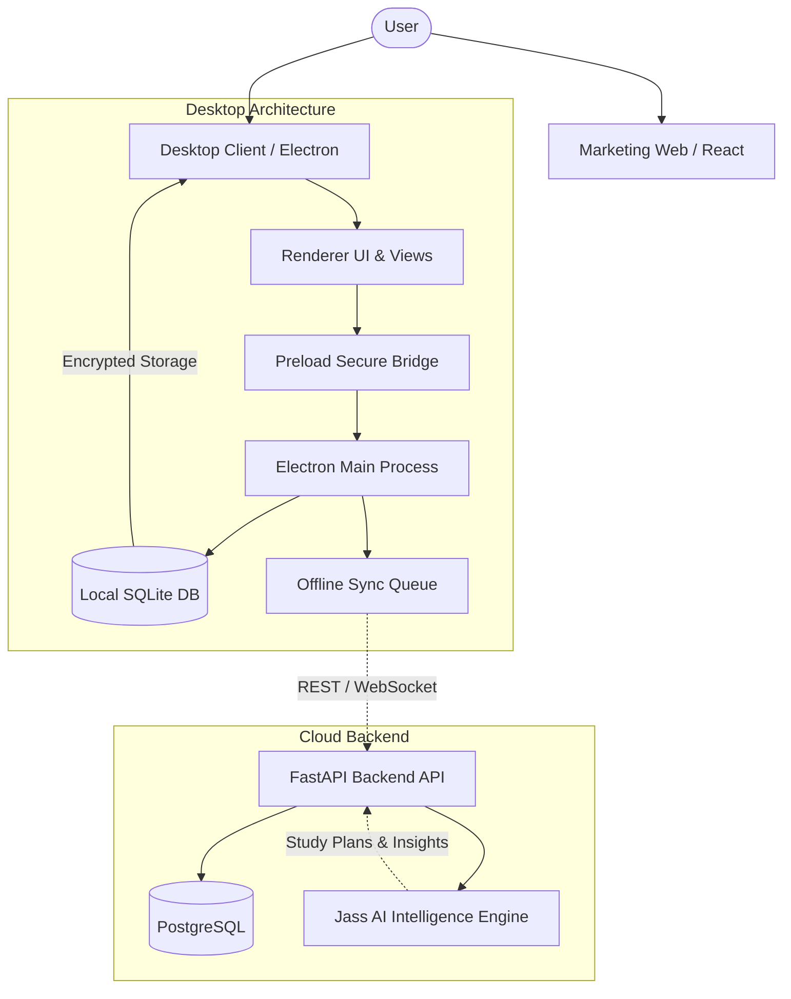

<div align="center">

  

  # StudyFlow AI

  **Plan with clarity. Study with momentum. Progress every day.**

  StudyFlow AI is an intelligent, local-first desktop workspace that brings planning, goal tracking, smart timeblocking, and deep focus sessions into a single distraction-free environment powered by Jass AI.

  <p align="center">
    <a href="https://github.com/syeedarshad/studyflow-ai/blob/main/LICENSE"></a>
    <a href="https://github.com/syeedarshad/studyflow-ai"></a>
    <a href="https://github.com/syeedarshad/studyflow-ai"></a>
    <a href="https://github.com/syeedarshad/studyflow-ai"></a>
    <a href="https://github.com/syeedarshad/studyflow-ai"></a>
  </p>

  <p align="center">
    <a href="#product-demonstration">Demo</a> •
    <a href="#why-studyflow-ai">Why StudyFlow AI</a> •
    <a href="#feature-story">Features</a> •
    <a href="#jass-ai-experience">Jass AI</a> •
    <a href="#architecture">Architecture</a> •
    <a href="#tech-stack">Tech Stack</a> •
    <a href="#getting-started">Installation</a> •
    <a href="#contributing">Contributing</a> •
    <a href="#license">License</a>
  </p>

</div>

---

## Product Demonstration

<div align="center">
  
  <p><em>The StudyFlow AI Dashboard — Live study streak, daily tasks, XP progress, and active study plans.</em></p>
</div>

---

## Why StudyFlow AI?

Managing academic coursework and personal learning often means juggling calendars, note apps, timers, and scattered spreadsheets. StudyFlow AI combines these tools into one cohesive system:

- **Connected, not fragmented**: Daily tasks trace directly back to your semester goals and career roadmaps, so you always know why today's work matters.
- **Realistic, actionable planning**: Jass AI turns dense course outlines into prioritized, time-estimated study sessions designed around your availability.
- **Local-first & privacy-focused**: Core task management, scheduling, notes, and timers run entirely offline on your device with local SQLite storage.
- **Deep focus by design**: Built-in Pomodoro cycles, ambient audio soundscapes, and an always-on-top floating desktop widget keep you in flow without context switching.

---

## Feature Story

### 1. Intelligent Syllabus Breakdown & Planning

Turn any course syllabus, chapter outline, or exam topic into a structured, step-by-step study plan. Jass AI estimates session lengths and orders concepts logically so you can start immediately rather than figuring out where to begin.

<div align="center">
  
</div>

---

### 2. Smart Timeblocking & Scheduling

Sessions fit around your real schedule. The weekly timeblocking view helps you organize dedicated study windows, balance workloads across subjects, and prevent last-minute cramming.

<div align="center">
  
</div>

---

### 3. Daily Action Connected to High-Level Goals

Tasks aren't just isolated to-dos—they link directly to your academic goals. Organize assignments by priority, filter by subject, and check off subtasks while watching your goal progress update in real time.

<div align="center">
  
</div>

---

### 4. Visual Semester & Career Roadmaps

Track multi-semester milestones and long-term skill progression. Roadmaps give you a visual timeline of where you've been and what comes next across terms and certifications.

<div align="center">
  
</div>

---

### 5. Deep Focus Mode & Mini Floating Widget

Lock into deep study sessions with the built-in Pomodoro timer and relaxing ambient soundscapes. Keep your momentum going with the compact, draggable mini-widget that floats above other windows.

<div align="center">
  
</div>

---

### 6. Honest Study Consistency & Analytics

Stay accountable with clear metrics. Track your 14-day study streaks, XP velocity, subject distributions, and completion trends with straightforward charts.

<div align="center">
  
</div>

---

## Jass AI Experience

**Jass AI** is designed as a practical study partner rather than an intrusive chatbot:

- **Syllabus-to-Plan Conversion**: Automatically decomposes course material into discrete, manageable sessions with duration estimates.
- **Interactive Study Coach**: Ask for clarifications on concepts, request study strategy recommendations, or brainstorm exam revision schedules.
- **Voice Input Support**: Dictate study notes or ask questions hands-free during active review sessions.
- **Always in Your Control**: Jass AI offers structured suggestions, but nothing is locked into your schedule until you review and approve it.

> **Note on AI Planning:** Jass AI provides starting structures and time estimates. Always review and adjust generated plans to match your personal study pace and energy levels.

---

## Feature Overview

| Capability | What It Does | Offline Support |
| :--- | :--- | :---: |
| **Dashboard** | Daily focus summary, active streak, energy patterns, and quick actions | Yes |
| **Task Management** | Prioritized to-do list with subject tags, subtasks, and deadline filters | Yes |
| **Smart Timeblocking** | Visual weekly schedule grid for assigning dedicated focus blocks | Yes |
| **Goal Tracking** | Hierarchical goal tracking linked directly to daily task completion | Yes |
| **Roadmaps** | Visual multi-semester timelines for academic and career milestones | Yes |
| **Focus Mode** | Pomodoro timer with ambient sounds (Rain, Cafe, White Noise) | Yes |
| **Mini-Widget** | Draggable desktop overlay with active task tracker and streak indicator | Yes |
| **Study Analytics** | 14-day XP consistency trend, subject breakdown, and study stats | Yes |
| **Exam Prep** | Exam countdown timer, syllabus confidence heatmaps, and revision sprints | Yes |
| **Wellness Alerts** | Hydration, posture, and 20-20-20 eye strain break reminders | Yes |
| **Jass AI Planning** | Intelligent syllabus breakdown and interactive study coaching | Cloud / Local |

---

## Architecture

StudyFlow AI uses a local-first desktop foundation with an optional cloud synchronization layer:



---

## Tech Stack

| Layer | Technologies | Role |
| :--- | :--- | :--- |
| **Desktop Client** | Electron 38, JavaScript (ES2022), HTML5, CSS3 | Native desktop application with dark glassmorphism interface |
| **Local Storage** | SQLite (`better-sqlite3`, `node:sqlite`), AES-GCM | Encrypted local database with user-isolated data and offline sync queue |
| **Visualizations** | Chart.js 4.4 | Real-time analytics, streak tracking, and subject distribution charts |
| **Backend API** | FastAPI, Python 3.11+, Pydantic v2, Uvicorn | Asynchronous REST endpoints, WebSocket notifications, and AI orchestration |
| **Cloud Database** | PostgreSQL, SQLAlchemy 2.0 (asyncpg), Alembic | Relational database schema with automated migration pipelines |
| **Web Showcase** | React 18, TypeScript, Vite, Framer Motion, Lucide | Modern product showcase website with responsive layouts and download links |
| **Packaging & Testing** | Electron Builder, Pytest, Node Test Runner | Automated test suites and Windows installer packaging (.exe) |

---

## Getting Started

### Prerequisites

- **Node.js**: v18.0.0 or higher ([Download Node.js](https://nodejs.org/))
- **npm**: v9.0.0 or higher
- **Python** *(Optional, for backend development)*: Python 3.11+

---

### 1. Clone the Repository

```bash
git clone https://github.com/syeedarshad/studyflow-ai.git
cd studyflow-ai
```

---

### 2. Run the Desktop Application

The desktop client runs independently with its built-in local SQLite engine:

```bash
# Navigate to the frontend directory
cd frontend

# Install dependencies
npm install

# Start the desktop application
npm start
```

*On Windows, you can also run `install.bat` from the repository root for automated setup.*

---

### 3. Run the Web Landing Page (Optional)

```bash
# Navigate to the web directory
cd web

# Install dependencies
npm install

# Start the Vite development server
npm run dev
```

---

### 4. Run the FastAPI Backend (Optional)

```bash
# Navigate to the backend directory
cd backend

# Create and activate a Python virtual environment
python -m venv .venv
# On Windows:
.venv\Scripts\activate
# On Linux/macOS:
source .venv/bin/activate

# Install dependencies
pip install -r requirements.txt

# Configure environment
cp .env.example .env

# Run migrations & start server
alembic upgrade head
uvicorn app.main:app --reload --port 8000
```

---

## Running Tests

### Frontend Test Suite
Runs unit, database, authentication, theme persistence, and sync queue tests:

```bash
cd frontend
npm test
```

### Backend Test Suite
Runs pytest test suite covering authentication, API endpoints, and database models:

```bash
cd backend
pytest
```

---

## Project Structure

```
studyflow-ai/
├── frontend/                  # Electron desktop application
│   ├── assets/                # App icons (.ico, .png, tray)
│   ├── src/
│   │   ├── main/              # Main process, SQLite database, IPC handlers
│   │   └── renderer/          # UI views, styles, and controllers
│   ├── test/                  # Automated frontend test suites
│   └── README.md
├── backend/                   # FastAPI Python backend service
│   ├── app/                   # API routers, models, schemas, and services
│   ├── core/                  # Security, authentication, and configuration
│   ├── database/              # SQLAlchemy session and database setup
│   ├── migrations/            # Alembic database migration versions
│   ├── tests/                 # Backend pytest test suite (151 tests)
│   └── README.md
├── web/                       # Modern marketing landing page (React + Vite)
│   ├── public/                # Static assets, logos, and screenshots
│   └── src/                   # React components, styles, and data
├── shared/                    # Shared types, schemas, and contract models
├── docs/                      # Technical documentation and media guidelines
│   └── media/                 # Demo GIF recordings and asset specs
├── .env.example               # Root environment configuration template
├── CONTRIBUTING.md            # Community contribution guidelines
├── SECURITY.md                # Security and vulnerability reporting policy
├── LICENSE                    # MIT Open Source License
└── README.md                  # Main project documentation
```

---

## Contributing

Contributions make the open-source community an amazing place to learn, inspire, and create. Any contributions you make are **greatly appreciated**.

Please see [CONTRIBUTING.md](CONTRIBUTING.md) for our branch workflow, coding standards, and pull request checklist.

1. Fork the Project
2. Create your Feature Branch (`git checkout -b feature/AmazingFeature`)
3. Commit your Changes (`git commit -m 'feat: add AmazingFeature'`)
4. Push to the Branch (`git push origin feature/AmazingFeature`)
5. Open a Pull Request

---

## Security

Please report security issues responsibly. See [SECURITY.md](SECURITY.md) for vulnerability reporting guidelines.

---

## License

Distributed under the **MIT License**. See [`LICENSE`](LICENSE) for details.

---

<div align="center">
  <sub>Built with care by <a href="https://github.com/syeedarshad">Syeed Arshad</a> and the open-source community.</sub>
</div>
