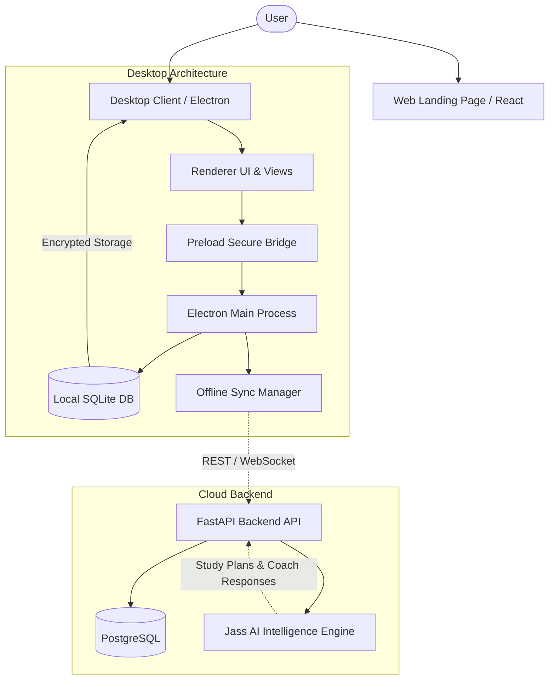

<div align="center">

  

  # StudyFlow AI

  **The Intelligent Desktop Workspace for Focused Students and Lifelong Learners.**

  StudyFlow AI unifies intelligent study planning, task management, smart timeblocking, and deep focus tracking into a clean, local-first desktop application powered by Jass AI.

  <p align="center">
    <a href="https://github.com/syeedarshad/studyflow-ai/blob/main/LICENSE"></a>
    <a href="https://github.com/syeedarshad/studyflow-ai"></a>
    <a href="https://github.com/syeedarshad/studyflow-ai"></a>
    <a href="https://github.com/syeedarshad/studyflow-ai"></a>
    <a href="https://github.com/syeedarshad/studyflow-ai"></a>
  </p>

  <p align="center">
    <a href="#about-studyflow-ai">About</a> •
    <a href="#product-preview">Product Preview</a> •
    <a href="#features">Features</a> •
    <a href="#tech-stack">Tech Stack</a> •
    <a href="#architecture">Architecture</a> •
    <a href="#getting-started">Getting Started</a> •
    <a href="#project-structure">Structure</a> •
    <a href="#roadmap">Roadmap</a> •
    <a href="#contributing">Contributing</a> •
    <a href="#license">License</a>
  </p>

</div>

---

## About StudyFlow AI

Modern students juggle multiple courses, complex exam schedules, career roadmaps, and personal projects across dozens of disconnected apps and browser tabs.

**StudyFlow AI** brings your entire academic and self-study workflow into one unified, distraction-free desktop application. It pairs local-first task and schedule management with **Jass AI**, an intelligent study copilot that transforms raw syllabi and learning goals into realistic, structured study sessions you can actually finish.

### Core Principles

- 🎯 **Action-Oriented Planning**: Break overwhelming textbooks and semester goals into time-estimated, actionable study sessions.
- ⚡ **Local-First & Resilient**: Core planning, task tracking, notes, and focus timers work completely offline with native local storage.
- 🧘 **Focus by Design**: Integrated Pomodoro cycles, ambient audio soundscapes, and a compact desktop widget keep you locked into deep work without context switching.
- 📈 **Honest Analytics**: Clear consistency tracking, focus streaks, and subject distribution charts show genuine progress over time.

---

## Product Preview

<div align="center">
  
  <p><em>StudyFlow AI Dashboard — Overview of daily tasks, study streaks, active plans, and energy patterns.</em></p>
</div>

<br />

<div align="center">
  <table>
    <tr>
      <td width="50%" align="center">
        
        <br /><strong>Jass AI Study Planning</strong><br /><em>Generate structured, multi-session study plans from any syllabus or goal.</em>
      </td>
      <td width="50%" align="center">
        
        <br /><strong>Smart Timeblocking</strong><br /><em>Conflict-free weekly session scheduling adapted to your availability.</em>
      </td>
    </tr>
    <tr>
      <td width="50%" align="center">
        
        <br /><strong>Goal-Connected Tasks</strong><br /><em>Connect daily assignments and study sprints directly to long-term goals.</em>
      </td>
      <td width="50%" align="center">
        
        <br /><strong>Career & Semester Roadmaps</strong><br /><em>Visualize multi-semester milestones and track degree progression.</em>
      </td>
    </tr>
    <tr>
      <td width="50%" align="center">
        
        <br /><strong>Deep Focus Mode</strong><br /><em>Customizable Pomodoro timer with ambient soundscapes and study tracking.</em>
      </td>
      <td width="50%" align="center">
        
        <br /><strong>Consistency & Analytics</strong><br /><em>14-day XP velocity, subject time breakdown, and habit metrics.</em>
      </td>
    </tr>
  </table>
</div>

---

## Features

- 🧠 **Jass AI Study Planner**: Turn syllabi, textbook chapters, or exam topics into structured, sequenced study plans with realistic session breakdowns.
- 📋 **Connected Goal & Task Management**: Organize tasks by subject, priority, and deadline, linking each daily item directly to larger milestones.
- ⏱️ **Smart Timeblocking & Schedule Grid**: Build conflict-free weekly schedules that respect your routine and prevent burnout.
- 🎯 **Deep Focus Mode**: Built-in Pomodoro cycles, ambient audio soundscapes (Rain, Cafe, White Noise), and session logs.
- 🪟 **Floating Desktop Mini-Widget**: Compact, always-on-top draggable widget showing active study tasks, streak counters, and daily progress.
- 🗺️ **Career & Semester Roadmaps**: Map out semester goals and multi-year career objectives with step-by-step milestone checkoffs.
- 📝 **Exam Preparation Center**: Exam countdowns, syllabus topic confidence heatmaps, and revision sprint tracking.
- 🎓 **Semester & Course Tracker**: Keep course details, credit weights, and academic goals organized in one place.
- 💬 **Jass AI Study Coach**: Ask questions, request topic explanations, get study strategy advice, and use hands-free voice input.
- 📊 **Study Analytics & XP System**: Earn XP for completed sessions, maintain daily streaks, complete daily quests, and unlock achievements.
- 📝 **Markdown Notes**: Lightweight note-taking interface with tag search and subject organization.
- 💧 **Wellness Reminders**: Gentle hydration, posture, and 20-20-20 eye strain break alerts.
- 🔒 **Local-First & Offline Resilience**: Embedded encrypted SQLite storage ensures complete privacy and seamless operation without internet.

---

## Tech Stack

| Layer | Technologies | Description |
| :--- | :--- | :--- |
| **Desktop Client** | Electron 38, JavaScript (ES2022), HTML5, CSS3 | Native desktop container with responsive dark theme and glassmorphism styling |
| **Local Data Store** | SQLite (`better-sqlite3`, `node:sqlite`), AES-GCM | Encrypted local database with user-isolated data storage and offline sync queue |
| **Visualization** | Chart.js 4.4 | Real-time analytics, 14-day XP trends, and subject distribution charts |
| **Backend Service** | FastAPI, Python 3.11+, Pydantic v2, Uvicorn | High-performance asynchronous REST API and WebSocket notification server |
| **Database & ORM** | PostgreSQL, SQLAlchemy 2.0 (asyncpg), Alembic | Relational database schema with automated asynchronous migration pipelines |
| **AI Integration** | Jass AI Engine | Backend-orchestrated intelligent planning, study coaching, and schedule synthesis |
| **Landing Page** | React 18, TypeScript, Vite, Framer Motion, Lucide | Modern product showcase website with animated reveals and responsive layout |
| **Packaging & Test** | Electron Builder, Pytest, Node Test Runner | Multi-platform packaging (.exe installer & portable) and automated test suites |

---

## Architecture

StudyFlow AI combines a local-first desktop client with an optional cloud backend:



---

## Getting Started

### Prerequisites

- **Node.js**: v18.0.0 or higher ([Download Node.js](https://nodejs.org/))
- **npm**: v9.0.0 or higher
- **Python** *(Optional, for backend development)*: Python 3.11+
- **PostgreSQL** *(Optional, for backend development)*: v14+ or Docker

---

### 1. Clone the Repository

```bash
git clone https://github.com/syeedarshad/studyflow-ai.git
cd studyflow-ai
```

---

### 2. Run the Desktop Application

The desktop application runs independently with its built-in local SQLite engine:

```bash
# Navigate to the frontend directory
cd frontend

# Install dependencies
npm install

# Launch the desktop application
npm start
```

*On Windows, you can also double-click `install.bat` at the repository root for automated setup.*

---

### 3. Run the Web Landing Page (Optional)

```bash
# Navigate to the web directory
cd web

# Install dependencies
npm install

# Start the Vite development server
npm run dev
```

The website will be available at `http://localhost:5173`.

---

### 4. Run the Backend API (Optional)

```bash
# Navigate to the backend directory
cd backend

# Create and activate a Python virtual environment
python -m venv .venv
# On Windows:
.venv\Scripts\activate
# On Linux/macOS:
source .venv/bin/activate

# Install dependencies
pip install -r requirements.txt

# Copy environment template and configure secrets
cp .env.example .env

# Run database migrations
alembic upgrade head

# Start the FastAPI server
uvicorn app.main:app --reload --port 8000
```

The interactive API documentation will be available at `http://127.0.0.1:8000/docs`.

---

## Environment Configuration

Configuration templates are provided for all components:

- **Root Template**: [`.env.example`](file:///.env.example)
- **Backend Template**: [`backend/.env.example`](file:///backend/.env.example)
- **Web Template**: [`web/.env.example`](file:///web/.env.example)

To configure the backend or web server, copy the relevant template:

```bash
# Backend configuration
cd backend
cp .env.example .env
```

> **Security Note:** Never commit `.env` files or API secrets to version control. All `.env` files are excluded by [`.gitignore`](file:///.gitignore).

---

## Running Tests

### Frontend Test Suite
Runs unit, integration, authentication, theme persistence, and sync manager tests:

```bash
cd frontend
npm test
```

### Backend Test Suite
Runs pytest test suite covering authentication, API endpoints, and database models:

```bash
cd backend
pytest
```

---

## Project Structure

```
studyflow-ai/
├── frontend/                  # Electron desktop application
│   ├── assets/                # Application icons (.ico, .png, tray)
│   ├── src/
│   │   ├── main/              # Electron main process & IPC handlers
│   │   └── renderer/          # UI views, styles, and client controllers
│   └── test/                  # Automated frontend test suites
├── backend/                   # FastAPI Python backend service
│   ├── app/                   # API routers, models, schemas, and services
│   ├── core/                  # Security, authentication, and app settings
│   ├── database/              # SQLAlchemy session and database setup
│   ├── migrations/            # Alembic database migration versions
│   └── tests/                 # Backend pytest test suite
├── web/                       # Modern marketing landing page (React + Vite)
│   ├── public/                # Static assets, screenshots, and downloads
│   └── src/                   # React components, styles, and data
├── shared/                    # Shared types, schemas, and contract models
├── docs/                      # Technical documentation and deployment guides
├── .env.example               # Root environment configuration template
├── CONTRIBUTING.md            # Community contribution guidelines
├── LICENSE                    # MIT Open Source License
└── README.md                  # Project documentation
```

---

## Jass AI Experience

**Jass AI** serves as your intelligent study companion within StudyFlow AI:

- **Syllabus Decomposition**: Submit course objectives, textbook indexes, or assignment lists; Jass AI structures them into ordered study sessions with estimated durations.
- **Adaptive Scheduling**: Study plans align with your peak focus hours and available daily study blocks.
- **Interactive Coaching**: Get clear explanations, study strategies, and exam preparation advice through the Coach interface.
- **Full User Control**: Jass AI generates recommendations, but you remain in complete control—edit, rearrange, or delete any session before approving it.

---

## Roadmap

- [x] Local-first Electron Desktop Application (Windows 64-bit)
- [x] Jass AI automated syllabus and study plan breakdown
- [x] Smart timeblocking, Pomodoro focus timer, and ambient soundscapes
- [x] Draggable desktop mini-widget with live task tracking
- [x] Goal hierarchy, career roadmaps, and exam preparation
- [x] 14-day study analytics, XP progression, daily quests, and achievements
- [x] FastAPI cloud backend with PostgreSQL & Alembic migrations
- [x] Responsive product showcase website
- [ ] Direct calendar synchronizations (Google Calendar, Apple Calendar, Outlook)
- [ ] LMS integration (Canvas, Blackboard syllabus import)
- [ ] Cross-platform desktop builds (macOS & Linux packages)
- [ ] Mobile companion dashboard (iOS & Android)

---

## Contributing

Contributions make the open-source community an amazing place to learn, inspire, and create. Any contributions you make are **greatly appreciated**.

Please see [CONTRIBUTING.md](CONTRIBUTING.md) for our branch workflow, coding standards, and pull request checklist.

1. Fork the Project
2. Create your Feature Branch (`git checkout -b feature/AmazingFeature`)
3. Commit your Changes (`git commit -m 'feat: add AmazingFeature'`)
4. Push to the Branch (`git push origin feature/AmazingFeature`)
5. Open a Pull Request

---

## License

Distributed under the **MIT License**. See [`LICENSE`](LICENSE) for more information.

---

<div align="center">
  <sub>Built with ❤️ by <a href="https://github.com/syeedarshad">Syeed Arshad</a> and the open-source community.</sub>
</div>
